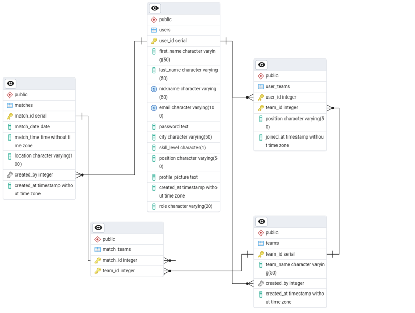

# **SetMatch**

Aplikacja SetMatch umożliwia organizowanie i wyszukiwanie amatorskich meczów siatkarskich. Pozwala na rejestrację użytkowników, tworzenie drużyn, planowanie meczów oraz zarządzanie danymi w panelu administratora.

### Spis treści
* Opis projektu
* Wykorzystane technologie
* Funkcjonalności
* Instrukcja instalacji i uruchomienia
* Konfiguracja bazy danych
* Diagram ERD
* Zrzuty ekranu
* Autorzy

### Opis projektu

Projekt SetMatch powstał jako aplikacja internetowa do umawiania amatorskich rozgrywek siatkarskich. Daje możliwość:

* Rejestracji i logowania użytkowników.
* Tworzenia drużyn oraz przypisywania do nich zawodników.
* Organizowania meczów, określania miejsca i czasu rozgrywki.
* Dołączania do istniejących meczów.
* Przeglądania zbliżających się meczów i zarządzania swoimi zapisami (np. opuszczenie meczu).
* Panel administratora daje opcję usuwania użytkowników, drużyn i meczów w celach moderacyjnych.
* Aplikacja wykorzystuje PHP, JavaScript, HTML oraz bazę danych PostgreSQL.

### Wykorzystane technologie

* **HTML5 i CSS**

  Responsywne układy dzięki media queries
* **JavaScript** (bez frameworków)

  Obsługa m.in. zapytań asynchronicznych fetch() (np. do wyszukiwania meczów)
* **PHP**

  Struktura z podziałem na kontrolery, modele oraz operacje na bazie\
  Obsługa routingu w pliku Routing.php
* **PostgreSQL**

  Definicja struktury bazy w pliku backup_setmatch.sql\
  Procedury, funkcje, widoki, wyzwalacz
* **Docker / Docker Compose**

  Pliki Dockerfile w katalogu docker/ (m.in. nginx, php, db)
  docker-compose.yml do uruchamiania usług (web, php, db, pgadmin)
* **Brak frameworków**

### Funkcjonalności

1. Rejestracja i logowanie
    * Formularz rejestracyjny (dwustopniowy: dane podstawowe + dane siatkarskie/zdjęcie)
    * Logowanie z weryfikacją hasła (hashowanie w bazie)
2. Utrzymanie sesji
    * Informacje o zalogowanym użytkowniku przechowywane w sesji
3. Tworzenie drużyn
    * Formularz umożliwia podanie nazwy drużyny, pozycji kapitana (użytkownik zalogowany) i opcjonalnie dodanie kolejnych graczy (do 7 osób)
    * Walidacja ID użytkownika (żeby nie dodawać nieistniejących) za pomocą AJAX/fetch()
4. Tworzenie meczu
    * Możliwość wyboru drużyny, wskazania daty, godziny i lokalizacji (hala)
    * Dane zapisywane w tabeli matches oraz match_teams
5. Kalendarz / przegląd meczów
    * Wyświetla mecze przyszłe, do których użytkownik jest przypisany
    * Opcja „Leave” umożliwia opuszczenie drużyny (tym samym meczu)
6. Dołączanie do meczu (Join)
    * Pokazuje listę „otwartych” meczów (gdzie drużyna nie jest pełna)
    * Sprawdzenie w DB, czy nie przekraczamy 7 osób w drużynie (trigger w bazie + logika w kodzie)
7. Panel administratora
    * Usuwanie użytkowników (wykluczenie z bazy)
    * Usuwanie drużyn
    * Usuwanie meczów
    * Wgląd w listę wszystkich użytkowników, drużyn i meczów

### Instrukcja instalacji i uruchomienia

1. Klonowanie repozytorium

* `git clone https://github.com/abulanda/SetMatch.git`
* `cd SetMatch`
2. Uruchomienie w Dockerze

* Upewnij się, że masz zainstalowane _docker_ i _docker-compose_.
* W głównym katalogu projektu (tam, gdzie docker-compose.yml) wykonaj:

    * `docker-compose build`
    * `docker-compose up`
* Po uruchomieniu aplikacja powinna być dostępna pod adresem http://localhost:8080.
3. Baza danych

* Domyślnie docker-compose wystawia Postgresa na porcie 5432 (hasło i login: docker).
* Jeśli chcesz, możesz zalogować się do pgAdmin na porcie 5050 (login: admin@admin.pl, hasło: admin).
4. Import bazy

* Skrypt _backup_setmatch.sql_ powinien zostać automatycznie załadowany po starcie kontenera Postgres.
* W razie potrzeby można go ręcznie zaimportować w pgAdmin lub przez CLI:

    * `psql -h localhost -p 5432 -U docker -d db -f backup_setmatch.sql`

5. Logowanie do aplikacji

* Panel logowania dostępny pod adresem http://localhost:8080/login.
* W przykładowej bazie istnieje ADMIN: login, hasło: admin.
* Zwykły użytkownik (np. mrys) ma hasło lalala.

### Konfiguracja bazy danych

Aplikacja przechowuje dane w PostgreSQL

W pliku _backup_setmatch.sql_ znajdują się:

* Struktury tabel i sekwencji.
* Widoki: view_all_matches, view_team_members.
* Wyzwalacz trg_check_team_capacity → wywołujący funkcję check_team_capacity().
* Procedura create_team_with_players(...).
* Przykładowe dane (INSERT / COPY).

#### Główne tabele:

1. users
    * Przechowuje dane zawodników (imiona, nazwiska, nickname, email, miasto, poziom zaawansowania, rola).
2. teams
    * Nazwa drużyny, kto ją stworzył (created_by) i kiedy.
3. user_teams (tabela łącząca)
    * Relacja wiele-do-wielu między users a teams. Zawiera pozycję użytkownika w drużynie (Setter, Libero itd.).
    * Wyzwalacz ogranicza liczbę zawodników w jednej drużynie do 7.
4. matches
    * Termin i miejsce meczu, kto stworzył.
5. match_teams (tabela łącząca)
    * Relacja wiele-do-wielu między matches a teams

###    Diagram ERD

### Zrzuty ekranu
Panel logowania:

Panele rejestracji:

Strona główna:

Tworzenie drużyny:

Dodawanie meczu:

Mecze użytkownika:

Panel administratora:

Autor:
Aleksandra Bulanda

Projekt realizowany na potrzeby zaliczenia przedmiotu Wstęp do projektowania aplikacji internetowych